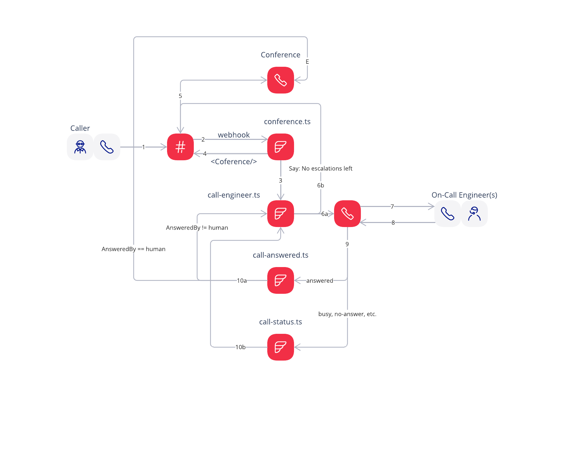

## On-Call implementation on Twilio with Conference

High level diagram:

To make it working just configure a phone number webhook to point to conference.ts function.

Couple of notes on the code:
- conference will end once any of the participants leaves the conference
- call-engineer.ts will check if the conference is still running before making next call
- list of on-call number is configured in call-engineer.ts as well as fromNumber, this is the number that your on-call engineers will receive calls from
- if all the on-call numbers were called the code will say to the caller that no escalations left
- in call-engineer.ts I left a comment where the slack massage should be sent, to escalate further
- in call-engineer.ts I use machineDetection: 'Enable' this will result in AnsweredBy parameter be present in callback once the call answered
- in call-answered.ts I check the value of AnsweredBy and connect to the conference only in case it is human who answered the call, otherwise proceed to the new escalation
- call-status.ts catches all the "negative" outcomes of the call and just triggers next escalation
